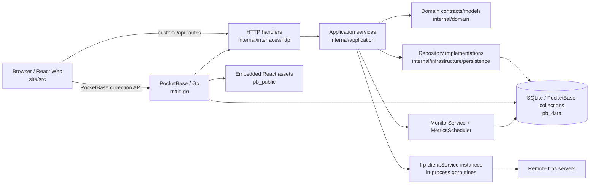
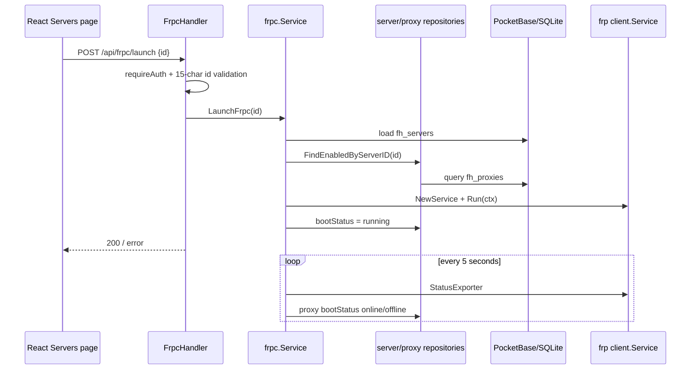
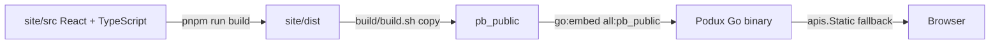

# System Architecture

## Verified Current State

Podux is a single Go/PocketBase service that hosts the API, SQLite persistence, background monitoring, frpc client services, and the React static site. The code calls running instances `processes`, but `internal/application/frpc/service.go` actually creates in-process `frp/client.Service` instances and runs them in goroutines; it does not launch separate `frpc` OS processes.

### Layers and Entry Points

- `main.go` creates the PocketBase app, registers migration commands, constructs repositories/services/handlers, binds the `fh_proxies` update hook, and initializes state, starts background tasks, registers routes, and configures the static-file fallback in `OnServe`.
- `internal/domain` currently defines lightweight models, status values, and repository interfaces only for servers and proxies.
- `internal/application` handles statistics, imports, frpc configuration/lifecycle, networking and metrics, system settings, and version queries.
- `internal/infrastructure/persistence` implements server and proxy repositories with dbx/PocketBase.
- `internal/interfaces/http` exposes `/api/dashboard/*`, `/api/frpc/*`, `/api/import/*`, `/api/servers*`, `/api/system/*`, and `/api/frp/version`. Except for initialization-status and initialization endpoints, registered custom routes use `requireAuth`.
- React also uses the PocketBase SDK directly for `fh_users`, `fh_servers`, and `fh_proxies`; collection API rules control that access boundary.

### Typical Request Flow

Standard server/proxy CRUD primarily uses the PocketBase SDK. Server lists, dashboard data, imports, settings, and runtime controls use custom APIs. After a successful `fh_proxies` update, a hook calls `ReloadFrpc` if the owning server is running.

### Startup Flow and Background Tasks

1. Go `init` loads `migrations`; `main` registers the migrate command and wires dependencies.
2. PocketBase `serve` triggers `OnServe`, which sets every server to `stopped` and every proxy to `offline`.
3. After a 10-second delay, servers with `autoConnection=true` start automatically.
4. `MonitorService` immediately runs TCP latency and missing-geolocation checks, then repeats them at intervals from `fh_settings.general`; server-side defaults are 5 seconds and 24 hours.
5. PocketBase cron aggregates raw metrics into hourly metrics at minute 5 of every hour. At 01:05 each day it aggregates daily metrics and deletes raw data older than 7 days and hourly data older than 30 days.
6. After handlers are registered, `pb_public` is served through `embed.FS` with an SPA fallback; `/_/` remains the PocketBase Admin UI.

### Frontend Build and Embedding

The Vite development server listens on `0.0.0.0` and proxies `/api` to `127.0.0.1:8090`. Production builds do not automatically copy files to `pb_public`; CI performs that step through artifact downloads, while `build/build.sh` copies them explicitly. Go compilation still requires the directory to exist when `pb_public/index.html` is missing, and runtime logs a warning.

## Configuration, Persistence, and Deployment Boundaries

- PocketBase uses `pb_data/` as its default data root; the Docker volume mounts `/app/pb_data`. The database, uploads, and `pb_data/frpc/<id>/logs|certs` are runtime data.
- Server connection/authentication/transport/logging/metadata settings are stored in collection JSON fields. TLS certificate contents are written to a server-specific certificates directory at startup, with private-key permissions set to `0600`. Never commit this content.
- The fixed system-settings record ID is `wcstsqmz8hur331`; the initialization transaction creates both the first `fh_users` record and the settings record.
- Geolocation and version queries access external services and depend on network availability. frpc instance status exists only in memory; database statuses are reset together on restart.
- The Dockerfile builds React and then compiles a static Go binary; deployment files define ports and volumes. This document makes no claims about production reverse proxies, backups, or high availability that are not verified in repository configuration.

## CI and Quality Boundaries

`.github/workflows/ci.yml` runs on pushes to main/dev and pull requests to main. It performs a frozen frontend install, permissive type checking (`continue-on-error`), and a production build; it then downloads the frontend artifact and runs `go vet` and a Linux amd64 build. CI currently does not run `go test`, frontend lint, or the documentation build, but this project's pre-submission baseline requires those checks locally. Pushes to dev also build and publish a multi-architecture container.

## To Be Confirmed

- `github_handler.go` and its service exist, but their wiring and registration are commented out in `main.go`; they must not be treated as a published API.
- No graceful-shutdown hook for `MonitorService` was found; it currently relies on process termination.
- No formal repository-level backup/restore, horizontal-scaling, or multi-instance mutual-exclusion design was found.
