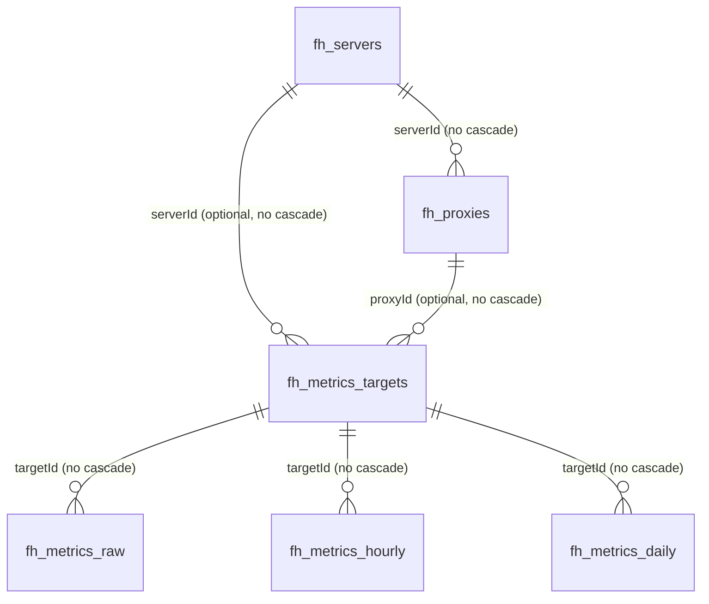

# Database Design

## Sources of Truth and Migration Constraints

PocketBase uses SQLite and registers Go migrations through the blank import of `migrations` in `main.go`; `migratecmd` enables `Automigrate: true`. The only current migration is `migrations/1774402980_collections_snapshot.go`, which imports a collection snapshot with `ImportCollectionsByMarshaledJSON(..., false)`; its rollback function is currently empty. The migration, not any running `pb_data/data.db`, is therefore the primary schema source of truth.

Every structure/rule/index change must add a reviewable migration with an appropriate rollback. Never modify production SQLite directly or make changes only through the PocketBase Admin UI. "Default" below records only snapshot autogeneration behavior; fields without an explicit statement have no verified schema default.

The snapshot also contains PocketBase system collections such as `_mfas`, `_otps`, `_externalAuths`, `_authOrigins`, and `_superusers`, which are not individually modeled here. There are nine application collections: `fh_users`, `fh_servers`, `fh_proxies`, `fh_version`, `fh_settings`, `fh_metrics_targets`, `fh_metrics_raw`, `fh_metrics_hourly`, and `fh_metrics_daily`.

Every base collection has a required system text primary key named `id`, automatically generated as 15 lowercase alphanumeric characters. Collections with `created`/`updated` use autodate fields. In the descriptions below, `—` means an empty rule, so only a superuser may perform that operation through the PocketBase Record API; this does not restrict internal server-side database/service access.

## Relationship Diagram

All relation fields use `maxSelect: 1`. The schema neither guarantees that each metrics target is bound exclusively to a server or a proxy nor defines a unique `(serverId, proxyId)` index.

## Collection Design

### `fh_users` (auth)

Purpose: Nodus login users. System fields: `password` (required, hidden, minimum 8 characters), `tokenKey` (required, hidden, 30–60 characters, automatically generated with 50 characters), `email` (required), `emailVisibility`, `verified`, `created`, and `updated`. Application fields: optional `nickname` text with max length 255; optional `avatar` file with at most one JPEG/PNG/SVG/GIF/WebP file; optional `passwordChangedAt` date.

Unique indexes: `tokenKey` and non-empty `email`. Password authentication is enabled with email as the identity; OAuth2, MFA, and OTP are disabled. The create rule is `@collection.fh_settings.initialized = false`; list/view/update/delete are restricted to `id = @request.auth.id`; the auth rule is empty, allowing authentication.

Mapping: `system.Service.InitializeSystem` creates the user; Login uses PocketBase `authWithPassword`; Settings/Profile reads and updates the user and avatar; ChangePasswordDialog updates the password.

### `fh_servers`

Purpose: remote frps connections and shared frpc configuration.

| Field | Type | Required/default | Description |
| --- | --- | --- | --- |
| `serverName` | text | Required | Display name |
| `serverAddr` | text | Required | frps address |
| `serverPort` | text | Required | Read/edited as an integer by the service/frontend |
| `description` | text | Optional | Description |
| `auth` | json | Optional | frp authentication; may contain tokens/secrets |
| `transport` | json | Optional | frp transport/TLS; may contain certificate private keys |
| `metadatas` | json | Optional | frp metadata |
| `log` | json | Optional | frp logging configuration |
| `serverVersion` | text | Required, auto `built-in` | Current frp source marker |
| `bootStatus` | text | Required, auto `stopped` | Runtime status; code uses running/stopped |
| `autoConnection` | bool | Optional | Connect automatically after startup |
| `geoLocation` | json | Optional | Populated by MonitorService |
| `user` | text | Optional | frp user |
| `created`,`updated` | autodate | Automatic | Creation/update timestamps |

Index: non-unique `bootStatus`. All list/view/create/update/delete rules require authentication. Mapping: there is no complete Go domain model; `ServerRecord` covers only ID/name. The server repository, frpc service, monitor service, and custom `/api/servers` handler read it; React Servers, ServerDetail, and ServerForm use it.

### `fh_proxies`

Purpose: frpc proxy configuration under a server.

| Field | Type | Required/default | Description |
| --- | --- | --- | --- |
| `name` | text | Required | Proxy name; the record ID is appended to the runtime name |
| `proxyType` | select | Required | One of tcp, udp, http, or https |
| `serverId` | relation -> `fh_servers` | Required, N:1 | No cascading delete |
| `localIP`,`localPort`,`remotePort`,`subdomain` | text | Optional | Endpoint configuration; Go maps ports with NullableInt |
| `customDomains` | json | Optional | Domain array |
| `transport`,`plugin` | json | Optional | Extended proxy configuration |
| `status` | select | Required | enabled/disabled |
| `bootStatus` | select | Required | online/offline |
| `created`,`updated` | autodate | Automatic | Creation/update timestamps |

Indexes: non-unique `serverId`, `proxyType`, and `status`. All CRUD/list/view rules require authentication. Mapping: `domain/proxy.Proxy`, the proxy repository/service, frpc configuration generation, and dashboard; used by React Proxies, ProxyForm, and ServerDetail. A successful update hook reloads a running server.

### `fh_settings`

Purpose: system initialization state and general settings. Fields are optional `initialized` bool, optional `general` JSON, and autodate `created`/`updated`; there are no application indexes. All list/view/create/update/delete rules require authentication, but the unauthenticated custom initialization API writes the fixed ID `wcstsqmz8hur331` inside a server-side transaction. Used `general` keys include `defaultLanguage`, `latencyCheckInterval`, and `locationCheckInterval`.

Mapping: `application/system.Service`, the system handler, React GeneralSettings, and the initialization flow.

### `fh_version`

Purpose: version name/path records. Optional text fields `version_name` and `version_path`, plus `created`/`updated`. It has no application indexes, and all Record API rules are `null`. The current version service returns the frp version from compile-time dependencies, while the system version uses buildinfo/an external release API. No application read/write path for this collection was found; its actual purpose remains to be confirmed.

### `fh_metrics_targets`

Purpose: bind a metric series to a server or proxy. `serverId` is an optional relation to `fh_servers`; `proxyId` is an optional relation to `fh_proxies`; neither cascades on deletion. There are no `created`/`updated` fields or indexes, and all Record API rules are `null`. `MetricsService` currently creates only targets with a populated `serverId` and empty `proxyId`, and caches server-to-target mappings in memory.

### `fh_metrics_raw`

Purpose: raw metric points. Required non-cascading `targetId` relation to `fh_metrics_targets`; optional `metricKey` select (currently only `frps_delay`); required `t` date; optional `val` number. The composite non-unique index is ordered `(targetId, t, metricKey)`. There are no autodate fields, and all Record API rules are `null`. MonitorService writes non-negative latency for reachable servers; the 01:05 daily job deletes data older than 7 days.

### `fh_metrics_hourly`

Purpose: hourly aggregates. Optional relation `targetId`, optional select `metricKey`, optional date `t`, and optional numbers `valAvg`/`valMax`/`valMin`. It has a composite non-unique `(metricKey, targetId, t)` index, no autodate fields, and `null` for all Record API rules. At minute 5 of every hour, the previous complete hour is aggregated and then updated or inserted after lookup by target/key/time. Data older than 30 days is deleted daily.

### `fh_metrics_daily`

Purpose: daily aggregates. Fields match hourly, and all three value fields are optional numbers. It has a composite non-unique `(targetId, metricKey, t)` index, no autodate fields, and `null` for all Record API rules. At 01:05 daily, the previous day's hourly values are aggregated and upserted; the code currently writes only `valAvg`. No retention policy for daily data was found.

## Lifecycle, Deletion, and Sensitivity

- Server/proxy runtime statuses are reset at startup. Status is a transient runtime projection; configuration itself is persistent.
- Aggregation follows raw -> hourly -> daily. Raw data is retained for 7 days and hourly data for 30 days; no verified limit exists for daily data.
- Every relation uses `cascadeDelete: false`. The schema does not automatically delete proxies/metrics targets with a server, and deleting proxies/targets may also leave related records. Although the UI shows a confirmation dialog, no server-side transactional cleanup was found; treat this as an orphaning risk.
- PocketBase protects `fh_users.password/tokenKey`; `fh_servers.auth/transport` may contain tokens, OIDC secrets, and TLS private keys. Logs mask common JSON key names, but original values must still never be exported, committed, or echoed.
- Migration workflow: identify callers -> add forward/down migrations -> update models/repositories/services/UI -> update this document -> verify upgrade and rollback against a temporary database -> run the full checks. Never rewrite the snapshot to falsify existing deployment history.

## Current Discrepancies / To Be Confirmed

- `domain/proxy.Proxy` declares and serializes `description`, but the `fh_proxies` migration has no such field; form payloads also include description. Do not assume here that the field exists.
- The `/api/servers` handler reads and returns `sendRate` and `recvRate`, but the migration defines neither field.
- ProfileSettings submits both `name` and `nickname`, while the migration defines only `nickname`.
- The migration defines `serverPort/localPort/remotePort` as text; some Go/frontend paths treat them as numbers. Preserve conversion compatibility and confirm the long-term type strategy.
- `fh_metrics_targets` has no uniqueness constraint. An in-process application lock only prevents concurrent duplicates within one process; multi-instance and pre-existing duplicate risks remain to be confirmed.
- Metric aggregation performs application-level "lookup then write" operations. Composite indexes are non-unique, so the database does not guarantee idempotent uniqueness.
- No caller for `fh_version` was found; its purpose remains to be confirmed.
- The snapshot migration has an empty down function and cannot automatically restore the pre-import schema; rollback strategy remains technical debt.
